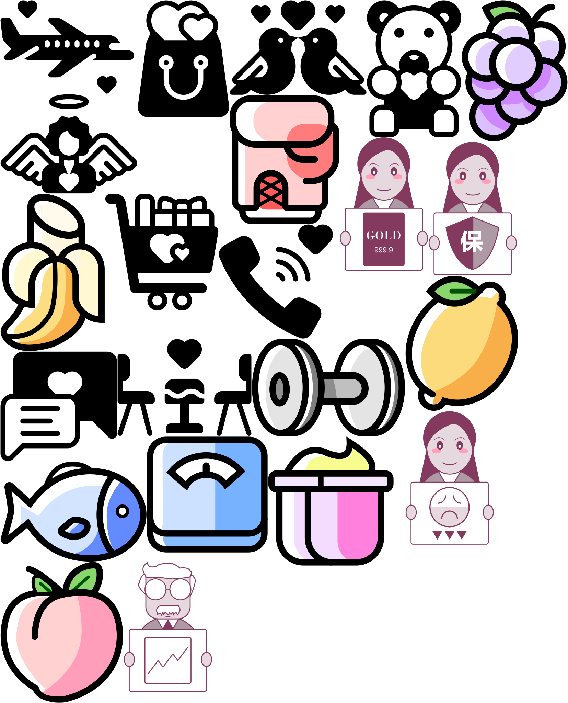

# Simple SVG sprite sheet generator

It takes a folder of SVGs and generates a single larger SVG along with a JSON file that indicates the position of each individual SVG.

## Setup & Usage

Place your SVG files inside the svg-builder/svgs directory.

Navigate to the project folder:

```sh
cd svg-builder
```

Install dependencies (use npm or pnpm):

```sh
npm install

# or

pnpm install
```

Run the builder:

```sh
node index.js
```

That’s it! 🎉

## Notes

Currently, this works only if the viewBox width and height match the SVG’s width and height. The SVG assets were re-exported from Figma, since that’s Figma’s default behavior.

The SVG atlas follows the TexturePacker JSON structure, which means it’s compatible with tools like Pixi.js, Babylon.js, or any framework that can rasterize the SVG before sending it to the GPU as a texture.

## pixi-app

it is just for example usage

## Result

### json

[json](svg-builder/svgAtlas-0.json)

### svg


